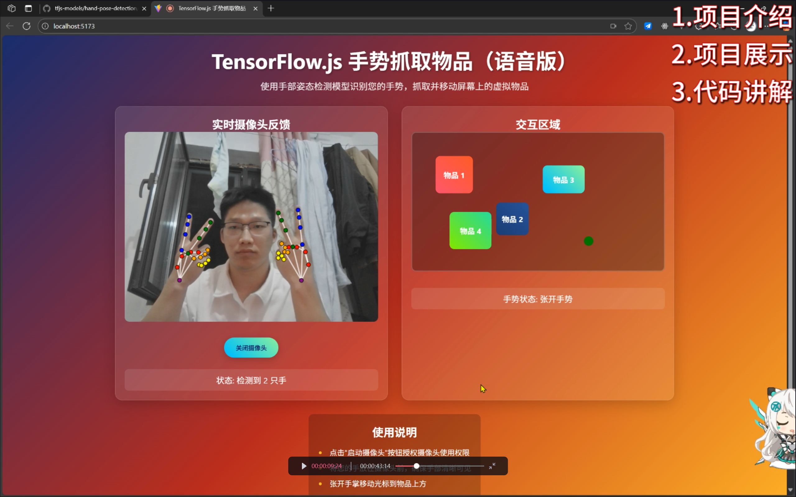

# TensorFlow.js 手势抓取物品

一个基于 [TensorFlow.js](https://github.com/tensorflow 和 [MediaPipe Hands](https://github.com/tensorflow/tfjs-models/blob/master/hand-pose-detection/demos/live_video/src/index.js) 的手势识别交互应用，可以通过摄像头实时检测手部动作并实现虚拟物品抓取交互。

## 视频教程
https://www.bilibili.com/video/BV1AgezzUEGK/?vd_source=610a594fa963f7a0a861e63e55503d54
## 🌟 功能特性

-   ​**实时手部检测**​：使用 MediaPipe Hands 模型检测手部21个关键点
-   ​**手势识别**​：识别抓取和张开手势
-   ​**虚拟交互**​：通过手势抓取和移动屏幕上的虚拟物体
-   ​**语音反馈**​：抓取物品时提供语音提示
-   ​**可视化界面**​：实时显示手部骨架和关键点

## 🛠️ 技术栈

-   ​**前端框架**​：原生 JavaScript (ES6+)
-   ​**手部检测**​：TensorFlow.js + MediaPipe Hands
-   ​**语音合成**​：Web Speech API
-   ​**样式**​：纯 CSS3

## 📁 项目结构

```
复制
hand-post/src
├── index.html          # 主页面
├── css/
│   └── style.css      # 样式文件
├── js/
│   ├── app.js         # 主应用文件
│   ├── camera.js      # 摄像头控制模块
│   ├── detector.js    # 手势检测模块
│   ├── renderer.js    # 绘制渲染模块
│   ├── interaction.js # 交互逻辑模块
│   ├── voice.js       # 语音合成模块
│   └── utils.js       # 工具函数
```

## 🚀 快速开始

### 环境要求

-   现代浏览器（Chrome、Firefox、Safari 等）
-   摄像头设备
-   支持 WebGL 的显卡（用于加速 TensorFlow.js）

### 安装步骤

1.  ​**克隆项目**​

    ```
    git clone https://github.com/zou-hong-run/hand-gesture-grab.git
    cd hand-gesture-grab
    ```

21.  ​**安装依赖**​

    ```
    npm install
    或者
    pnpm install
    ```

1.  ​**启动应用**​

    -   方式一：启动本地服务器

        ```
        pnpm dev
        或者
        npm run dev
        ```

1.  ​**访问应用**​  
    打开浏览器访问 `http://localhost:5173/`

## 🎮 使用方法

1.  ​**启动摄像头**​：点击"启动摄像头"按钮授权摄像头访问

1.  ​**手势识别**​：

    -   ​**张开手势**​：拇指和食指分开
    -   ​**抓取手势**​：拇指和食指捏合

1.  ​**交互操作**​：

    -   将虚拟光标移动到物体上方
    -   做出抓取手势抓取物体
    -   移动手部来拖动物体
    -   张开手势释放物体

## 🔧 配置选项

在 `js/detector.js` 中可以调整检测参数：

```
const detectorConfig = {
  runtime: 'mediapipe',    // 运行环境
  modelType: 'full',       // 模型精度：'full' | 'lite'
  maxHands: 2,            // 最大检测手数
  solutionPath: "node_modules/@mediapipe/hands/" // 模型路径
};
```

## 📊 手势检测原理

应用基于手部21个关键点的相对位置关系识别手势：

-   ​**抓取手势**​：拇指尖和食指尖距离 < 40px
-   ​**张开手势**​：拇指尖和食指尖距离 ≥ 40px

## 🌐 浏览器兼容性

| 浏览器     | 支持情况    | 备注          |
| ------- | ------- | ----------- |
| Chrome  | ✅ 完全支持  | 推荐使用        |
| Firefox | ✅ 支持    | 需要启用摄像头权限   |
| Safari  | ⚠️ 部分支持 | 需要 HTTPS    |
| Edge    | ✅ 支持    | 基于 Chromium |

## 🐛 常见问题

### Q: 摄像头无法启动

A: 确保浏览器有摄像头访问权限，尝试使用 HTTPS 连接

### Q: 模型加载失败

A: 检查网络连接，确保可以访问 MediaPipe CDN

### Q: 检测不准确

A: 确保光线充足，手部在摄像头范围内清晰可见

### Q: 性能问题

A: 尝试使用 'lite' 模型或降低摄像头分辨率

## 📝 API 参考

### 主要函数

-   `init()`: 初始化应用
-   `toggleCamera()`: 切换摄像头状态
-   `detectHands()`: 手部检测主循环
-   `analyzeGesture()`: 手势分析
-   `updateInteraction()`: 更新交互状态

### 事件监听

-   `startBtn.click`: 摄像头开关
-   `video.onloadedmetadata`: 视频就绪事件

## 🎨 自定义配置

### 修改交互区域

在 `index.html` 中修改 `.interaction-area` 的样式

### 添加新物体

```
<div class="object" style="left: 100px; top: 100px; background: blue;"></div>
```

### 调整手势灵敏度

在 `js/detector.js` 中修改距离阈值：

```
// 当前阈值
const GRAB_THRESHOLD = 40;
```

## 🤝 贡献指南

1.  Fork 项目
1.  创建特性分支 (`git checkout -b feature/AmazingFeature`)
1.  提交更改 (`git commit -m 'Add some AmazingFeature'`)
1.  推送到分支 (`git push origin feature/AmazingFeature`)
1.  打开 Pull Request

## 📄 许可证

本项目采用 MIT 许可证 - 查看 LICENSE 文件了解详情

## 🙏 致谢

-   TensorFlow.js
-   MediaPipe
-   Web Speech API

## 📞 联系信息

如有问题或建议，请通过以下方式联系：

-   提交 Issue
-   发送邮件至: zhr19853149156@163.com

* * *

⭐ 如果这个项目对你有帮助，请给它一个 Star！

## 赞助（您的支持是我最大的更新动力）


