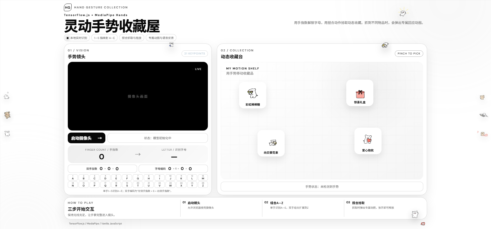

# 灵动手势收藏屋

基于 TensorFlow.js 与 MediaPipe Hands 的浏览器端实时手势交互项目。



- 项目维护者：李雨
- 学号：420231159029

## 项目功能

页面顶部提供“字母识别、收藏品抓取、球体抓取”三个模式按钮，三项功能互相独立，可随时切换。
字母编码面板只在“字母识别”模式显示和运行；进入收藏品或球体模式后会暂停字母计算与英文播报，为摄像头交互留出更大的显示区域。

### A—Z 字母识别

- 握拳时立即识别为数字 0；拇指收在掌内不会再被误算为伸出。
- 单手伸出 1—5 根手指时，分别识别为 A—E。
- 同时检测两只手时，按画面位置区分左侧手和右侧手。
- 页面实时显示双手加数：`左侧手指数 + 右侧手指数 = 总手指数`。
- 字母编码为两侧手指数的拼接：例如左侧 2 根、右侧 3 根拼成 `23`。
- 拼接数字 1—26 依次映射为 A—Z，超出范围显示“—”。
- 字母稳定变化后，通过 Web Speech API 使用英语播报识别结果。

示例：

| 左侧手 | 右侧手 | 拼接数字 | 字母 |
| --- | --- | --- | --- |
| 2 | 3 | 23 | W |
| 1 | 5 | 15 | O |
| 2 | 5 | 25 | Y |
| 4 | 2 | 42 | — |

### 动态收藏品抓取

项目保留原有的捏合抓取交互：

- 拇指和食指捏合：抓取物品。
- 移动手掌：拖动物品。
- 拇指和食指张开：释放物品。
- 成功抓取时播报真实物品名称。
- 也可以直接用鼠标（或触屏）拖动收藏品，自由布置摆放位置。

收藏台中的物品包括：

- 彩虹棒棒糖
- 惊喜礼盒
- 向日葵花束
- 爱心抱枕
- 节拍耳机
- 守护天使
- 庆祝彩带
- 魔法星星

每种物品均使用本地 GIF 动态素材，并配置了与物品语义对应的专属弹出回应动图。

### 摄像头球体抓取

- 切换到“球体抓取”后，多颗彩色高光球从实时摄像头画面顶部循环下落；球不会撞击地面，而是从底部离场消失，再重新从顶部进入。
- 捏合时使用拇指尖与食指尖的中点作为抓取点；张掌时使用掌心作为托举和拍击位置。
- 张开手掌可从下方托举，快速挥手可弹性拍开球体；捏合两指可抓住，移动手掌可拖动，张开两指释放。
- 球体具有重力、侧边碰撞和球间碰撞，抓取、释放与拍击时只显示柔和粒子反馈，不触发收藏品弹窗或名称播报；也支持鼠标或触屏拖动测试。
- 球体模式支持真实隔空控制：握拳产生吸引力场，张掌可托举或拍击，单独伸出食指可轻触弹球；单手捏合会根据指距产生软体挤压，移动后释放会继承手速形成抛掷；双手同时捏合可拉伸和缩放球体。高速运动时会产生渐隐轨迹。
- 摄像头画面内设有空中目标圈。只有经过手势控制的球进入目标圈才计分，成功后显示粒子并重新生成球体。
- 在保留上述交互的基础上，球体模式加入“数字生命场”：张掌产生连续斥力，握拳产生引力，旋转手掌形成涡流；手掌张开幅度控制范围，移动速度、捏合强度和掌面倾斜连续改变球体运动。
- 双手之间形成能量绳；双手靠近或展开会压缩、膨胀整个球群。两只张开的手掌构成空间传送门，球靠近一侧后从另一侧出现。
- 球体随机获得水球、果冻、玻璃、火焰、磁力或泡泡材质，每种材质具有不同的重力、阻尼、弹性、漂浮、磁力或碎裂反应。
- 同材质软球在经过手势控制后低速碰撞可融合成长；双手捏合拉伸超过阈值后会分裂为两颗小球。
- 本地 BlazePose 姿态模型识别肩、肘、腕、髋与膝，球体可与身体和手臂轮廓碰撞并沿肢体方向滚动。
- 球体拥有好奇、害羞、开心、平静、调皮、生气和孤独状态：会主动靠近、躲避、绕手运动、受击变得生气，长时间未互动则主动寻找用户。
- 单独伸出食指可绘制发光路径，附近球体会跟随轨迹；轨迹闭合为圆后会形成短时环形轨道。

## 个性化设计

- 项目名称、标题和页脚均围绕手势交互主题设计。
- 重新设计为白色背景、黑色文字的单屏手势交互工作台界面。
- 标题区、摄像头区、收藏台、使用说明和抓取弹窗均使用动态表情素材。
- 收藏品错落摆放，两侧贴纸栏、收藏台角落与页脚搭配“线条小狗”静态素材装饰。
- 显示完整 A—Z 字母表，当前识别字母会高亮。
- 使用 6 帧多数表决平滑两侧手指数，减少字母跳动。
- 模型与视频数据均在浏览器本地处理。

## 运行方法

```powershell
cd D:\hand_gesture_grab
npm install
npm run dev
```

浏览器访问：

```text
http://localhost:5173/
```

点击“启动摄像头”并允许摄像头权限即可开始体验。

## 生产构建

```powershell
npm run build
```

构建结果保存在 `dist` 目录。

## 主要文件

```text
src/
├── main.js                    页面初始化与摄像头开关
├── index.css                  个性化页面样式
└── js/
    ├── camera.js              摄像头控制
    ├── detector.js            双手检测、结果平滑与字母播报
    ├── gesture-recognition.js 手指数统计与 A—Z 编码
    ├── interaction.js         收藏品/摄像头球体抓取、拖放、语音和动图反馈
    ├── renderer.js            手部关键点绘制
    ├── utils.js               页面状态更新
    └── voice.js               中文物品播报与英文字母播报
```

## 技术栈

- TensorFlow.js
- MediaPipe Hands
- Vite
- 原生 JavaScript、HTML 与 CSS
- Web Speech API
- MediaDevices API

## 说明

本项目由李雨维护，是在 MIT 许可的 `zou-hong-run/hand-gesture-grab` 基础上完成的独立版本。当前版本实现了三模式切换、握拳0识别、A—Z双手拼接编码、摄像头画面弹力球物理交互、分侧多帧平滑、双手加数、英文播报、动态收藏品、鼠标拖拽布置、识别状态灯、专属反馈动图、单屏响应式界面与静态素材装饰，并保留原项目的许可证及上游来源说明。

详细实现见 [技术说明](docs/技术说明.md)，操作方法见 [使用手册](docs/使用手册.md)。
